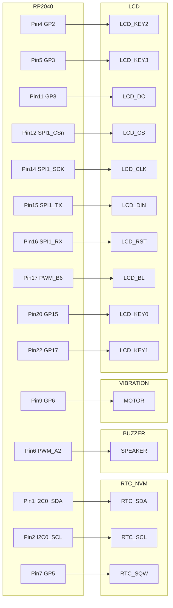
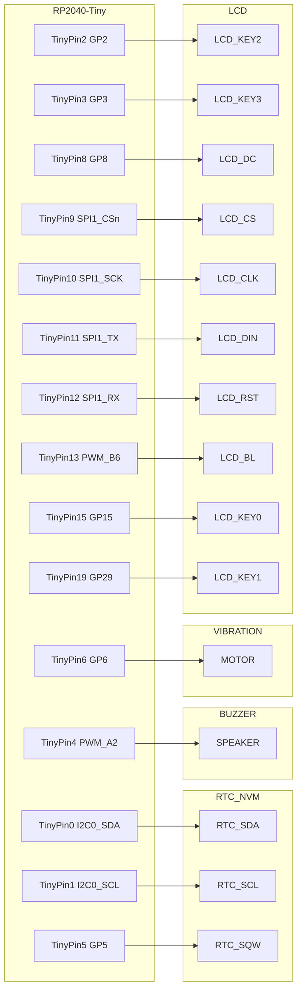

+++
title = "PicoPet"
date = 2024-12-12T02:50:00-05:00
author = "Dennis Lawter"
tags = ["rust"]
keywords = ["software engineer", "rust"]
description = "A custom vpet project"
showFullContent = false
readingTime = true
draft = false
+++

# PicoPet

[View the project on GitHub](https://github.com/dennis-lawter/pico-pet)

A virtual pet that requires the user to complete pomodoros for the health of their pet.

## Hardware
- Raspberry Pi Pico
    - [Raspberry Pi Pico](https://www.raspberrypi.com/products/raspberry-pi-pico/) for development
    - [Waveshare RP2040-Tiny](https://www.waveshare.com/rp2040-tiny.htm) for release
- [Waveshare 1.44" LCD](https://www.waveshare.com/pico-lcd-1.44.htm)
- [DS3231](https://www.amazon.com/dp/B09KPC8JZQ/)
- Any 5v to 3v3 shifter for the DS3231, [for example](https://www.amazon.com/dp/B07LG646VS/)
- Any 5v speaker or buzzer, [for example](https://www.amazon.com/dp/B07P6X9YX7/)
- Any 3v-5v vibrating motor, [for example](https://www.amazon.com/dp/B073YFR5WR)

## NVM Utilization
The NVM (Non-Volatile Memory) module included with the DS3231 provides 4KiB arranged in 512 pages of 8 bytes each.

Permanent storage must be serializable to a specified number of pages, and write to an assigned page address.

Pages are addressed from hexidecimal 0x000 to 0x1ff.

| Page Start | Page End | Module |
| --- | --- | --- |
| 000 | 000 | Header |
| 001 | 002 | Settings |
| 003 | 003 | Inventory |
| 004 | 005 | Pet |

*note: If the NVM becomes corrupted, try changing the const `NVM_SENTINEL` to force a header guard check failure. This will factory reset the device, and all data will be lost.*
|  | **Header** |
| --- | --- |
| 0 | if set to the `NVM_SENTINEL` value, then the EEPROM is assumed to contain a valid savefile |
| 1 |  |
| 2 |  |
| 3 |  |
| 4 |  |
| 5 |  |
| 6 |  |
| 7 |  |

|  | **Settings Page 1** | min | max |
| --- | --- | --- | --- |
| 0 | User brightness | 0 | 15 |
| 1 | User volume | 0 | 4 |
| 2 | *nyi* Vibration enabled | 0 | 1 |
| 3 | *nyi* 12hr clock enabled | 0 | 1 |
| 4 | *nyi* minutes before device sleeps | 1 | 90 |
| 5 |  |  |  |
| 6 |  |  |  |
| 7 |  |  |  |

|  | **Settings Page 2** | min | max |
| --- | --- | --- | --- |
| 0 | Pomodoro length in minutes | 1 | 90 |
| 1 | Short break length in minutes | 1 | 90 |
| 2 | Long break length in minutes | 1 | 90 |
| 3 | Cycles, aka number of pomodoros before a long rest | 1 | 9 |
| 4 | Pet feeding deadline hr | 0 | 23 |
| 5 | Pet feeding deadline min | 0 | 59 |
| 6 |  |  |  |
| 7 |  |  |  |

|  | **Inventory** | min | max |
| --- | --- | --- | --- |
| 0 | Tomatoes | 0 | 99 |
| 1 | Raspberries | 0 | 9 |
| 2 | Lower byte of juice value |  |  |
| 3 | Higher byte of juice value |  |  |
| 4 |  |  |  |
| 5 |  |  |  |
| 6 |  |  |  |
| 7 |  |  |  |

Max juice is 9999ml as a u16

|  | **Pet Page 1** |
| --- | --- |
| 0 | Birth Day |
| 1 | Birth Month |
| 2 | Birth Year |
| 3 |  |
| 4 |  |
| 5 |  |
| 6 |  |
| 7 |  |

|  | **Pet Page 2** |
| --- | --- |
| 0 | Current HP |
| 1 | Sickness |
| 2 | Daily Hunger |
| 3 | Last Fed Day |
| 4 | Last Fed Month |
| 5 | Last Fed Year |
| 6 |  |
| 7 |  |

## Pin Out For Raspberry Pico

## Pinout for Waveshare RP2040-Tiny

## Attributions
Placeholder artwork (lofi.png) copyright belongs to Juan Pablo Machado.
